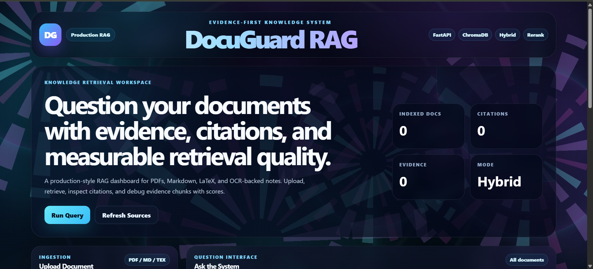
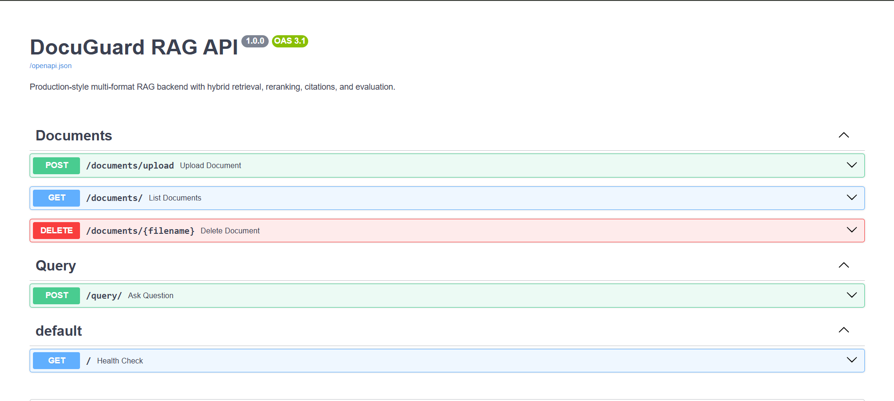

# DocuGuard RAG

DocuGuard RAG is a production-style Retrieval-Augmented Generation system for asking questions over PDFs, research papers, technical notes, Markdown files, and LaTeX documents.

It supports hybrid retrieval, reranking, citation inspection, local LLM answer generation using Ollama, parser selection controls, layout-aware PDF parsing, and observability metrics for debugging retrieval and latency issues.

This is not a basic PDF chatbot. It is built as an engineering-focused RAG system where every answer can be inspected through retrieved chunks, citations, answer mode, and query-level traces.

---

## What DocuGuard RAG Solves

Most RAG demos only show:

```text
PDF → chunks → embeddings → answer
```

DocuGuard RAG adds the missing production components:

```text
Document Upload
      ↓
Parser Selection
      ↓
Layout-Aware Extraction
      ↓
Chunking
      ↓
Vector + BM25 Retrieval
      ↓
Hybrid Search
      ↓
Cross-Encoder Reranking
      ↓
Context Builder
      ↓
Ollama Local LLM
      ↓
Answer + Citations + Retrieved Evidence
      ↓
Observability Logs + Metrics Dashboard
```

The goal is to make document QA explainable, inspectable, and debuggable.

---

## Key Features

### Multi-Format Document Ingestion

* PDF upload
* Markdown upload
* LaTeX `.tex` upload
* Page-level PDF metadata
* Source-level document filtering
* Document listing and deletion

### Parser Selection Controls

During upload, the user can manually select:

#### Document Type

* Auto Detect
* PDF with text layer
* Scanned PDF / OCR-heavy
* Slides / PPT-style PDF
* Report / multi-section document
* Markdown
* LaTeX

#### Extraction Mode

* Auto
* Text layer only
* OCR only
* Text + OCR hybrid

#### Layout Mode

* Auto layout detection
* Default reading order
* Multi-column / left-right continuation
* Slide layout
* Report layout
* Preserve regions and coordinates

This is important because a `.pdf` file can be a normal text PDF, scanned notes, a slide deck, a report, a OneNote export, or a mixed-layout document.

---

## Retrieval Pipeline

DocuGuard RAG uses a hybrid retrieval system:

1. User question is expanded using document-specific acronyms.
2. ChromaDB vector search retrieves semantic candidates.
3. BM25 retrieves exact keyword and acronym matches.
4. Hybrid retrieval combines semantic and lexical search.
5. Cross-encoder reranker reorders candidates.
6. Top chunks are passed to the LLM.
7. Citations and retrieved chunks are returned with the answer.

---

## Answer Generation

DocuGuard RAG uses **Ollama** for local LLM generation.

No paid Gemini/OpenAI API key is required for the main answer generation path.

Current generation flow:

```text
Retrieved chunks
      ↓
Relevant context compression
      ↓
Ollama local model
      ↓
Clean document-grounded answer
      ↓
Citations shown separately
```

Supported answer modes:

```text
llm
extractive_fallback
no_results
error
```

If Ollama is unavailable, the system falls back to a conservative extractive answer. This fallback is not the main product output; it is only a safety mechanism.

---

## Observability

DocuGuard RAG logs every query into a JSONL trace file.

Query traces are stored at:

```text
data/processed/observability/query_logs.jsonl
```

Each query trace includes:

* query ID
* timestamp
* question
* selected source
* retrieval mode
* top K
* expanded query
* retrieved chunk IDs
* reranked chunk IDs
* citation count
* answer mode
* answer length
* retrieval latency
* rerank latency
* LLM generation latency
* total latency
* failure reason

Example trace:

```json
{
  "query_id": "q_f3b946be2365",
  "question": "what is image segmentation",
  "selected_source": "INTRODUCTION_TO_IMAGE_PROCESSING_29aug06.pdf",
  "retrieval_mode": "hybrid",
  "top_k": 1,
  "answer_mode": "llm",
  "citation_count": 1,
  "latency_ms": {
    "retrieval": 139.106,
    "rerank": 2724.378,
    "llm_generation": 9973.585,
    "total": 12840.551
  }
}
```

---

## Metrics Dashboard

The frontend includes an observability dashboard showing:

* total queries
* latest latency
* P50 latency
* P95 latency
* failure rate
* citation coverage
* LLM answer count
* fallback answer count
* retrieval average latency
* rerank average latency
* LLM average latency
* recent query logs

This makes it possible to diagnose performance and retrieval failures instead of guessing.

---

## Tech Stack

| Layer          | Technology                             |
| -------------- | -------------------------------------- |
| Backend        | FastAPI                                |
| Frontend       | React + Vite                           |
| Vector Store   | ChromaDB                               |
| Embeddings     | SentenceTransformers                   |
| Keyword Search | BM25                                   |
| Reranking      | CrossEncoder                           |
| PDF Parsing    | PyMuPDF                                |
| OCR Foundation | Tesseract / pytesseract-ready pipeline |
| LLM            | Ollama local models                    |
| Observability  | JSONL tracing + metrics API            |
| UI             | Cyberpunk-style React dashboard        |

---

## Recommended Ollama Models

For faster local demo:

```bash
ollama pull qwen2.5:1.5b
```

For better quality but slower response:

```bash
ollama pull llama3.2:3b
```

Recommended `.env` for faster demo:

```env
LLM_PROVIDER=ollama
OLLAMA_BASE_URL=http://localhost:11434
OLLAMA_MODEL=qwen2.5:1.5b
OLLAMA_MAX_CONTEXT_CHARS=3000
OLLAMA_TIMEOUT_SECONDS=180
OLLAMA_NUM_PREDICT=160
```

---

## Project Structure

```text
DocuGuardRAG/
├── app/
│   ├── api/
│   │   ├── ingest.py
│   │   ├── query.py
│   │   └── metrics.py
│   ├── core/
│   │   ├── generator.py
│   │   ├── pdf_parser.py
│   │   ├── vector_store.py
│   │   ├── hybrid_retriever.py
│   │   ├── reranker.py
│   │   ├── context_builder.py
│   │   └── observability.py
│   ├── schemas/
│   │   └── models.py
│   └── main.py
├── frontend/
│   ├── src/
│   │   ├── App.jsx
│   │   ├── App.css
│   │   └── api.js
├── assets/
├── data/
│   ├── raw/
│   ├── processed/
│   └── processed/observability/query_logs.jsonl
├── eval/
├── tests/
├── requirements.txt
├── Dockerfile
├── docker-compose.yml
└── README.md
```

---

## Setup Instructions

### 1. Clone the repository

```bash
git clone https://github.com/SagarInspires/DocuGuardRAG.git
cd DocuGuardRAG
```

---

### 2. Create virtual environment

```bash
python -m venv venv
```

Windows:

```powershell
.\venv\Scripts\activate
```

Linux / Mac:

```bash
source venv/bin/activate
```

---

### 3. Install backend dependencies

```bash
pip install -r requirements.txt
```

If needed:

```bash
pip install fastapi uvicorn[standard] requests
```

---

### 4. Install Ollama

Install Ollama from:

```text
https://ollama.com
```

Pull a local model:

```bash
ollama pull qwen2.5:1.5b
```

Check whether Ollama is running:

```bash
curl http://localhost:11434/api/tags
```

---

### 5. Create `.env`

Create a `.env` file in the project root:

```env
LLM_PROVIDER=ollama
OLLAMA_BASE_URL=http://localhost:11434
OLLAMA_MODEL=qwen2.5:1.5b
OLLAMA_MAX_CONTEXT_CHARS=3000
OLLAMA_TIMEOUT_SECONDS=180
OLLAMA_NUM_PREDICT=160
```

Do not commit `.env`.

---

### 6. Run backend

```bash
python -m uvicorn app.main:app --reload
```

Backend runs at:

```text
http://127.0.0.1:8000
```

Swagger docs:

```text
http://127.0.0.1:8000/docs
```

---

### 7. Run frontend

```bash
cd frontend
npm install
npm run dev
```

Frontend runs at:

```text
http://localhost:5173
```

---

## API Endpoints

### Health Check

```http
GET /
```

---

### Documents

```http
POST /documents/upload
GET /documents/
DELETE /documents/{filename}
```

---

### Query

```http
POST /query/
```

Example request:

```json
{
  "question": "what is image segmentation",
  "source": "INTRODUCTION_TO_IMAGE_PROCESSING_29aug06.pdf",
  "top_k": 1,
  "retrieval_mode": "hybrid"
}
```

Example response:

```json
{
  "answer": "Image segmentation is the process of subdividing an image into its constituent parts or objects.",
  "answer_mode": "llm",
  "citations": [
    {
      "source": "INTRODUCTION_TO_IMAGE_PROCESSING_29aug06.pdf",
      "page": 5,
      "chunk_id": "INTRODUCTION_TO_IMAGE_PROCESSING_29aug06.pdf_p5_c0"
    }
  ],
  "retrieved_chunks": []
}
```

---

### Metrics

```http
GET /metrics/summary
GET /metrics/recent
```

Example `/metrics/summary` fields:

```json
{
  "query_count": 2,
  "answer_modes": {
    "llm": 2
  },
  "failure_rate": 0.0,
  "citation_coverage_rate": 1.0,
  "latency_ms": {
    "total": {
      "avg": 40598.406,
      "p50": 40598.406,
      "p95": 65580.476
    }
  }
}
```

---

## Frontend Dashboard

The React dashboard supports:

* document upload
* parser option selection
* document scope selection
* top K control
* retrieval mode control
* answer display
* answer mode badge
* citation panel
* retrieved chunk inspector
* extraction method display
* production metrics dashboard
* recent query logs
* animated cyberpunk-style UI

---

## Screenshots

Add screenshots in the `assets/` folder.

Recommended screenshots:

```text
assets/dashboard.png
assets/query_result.png
assets/observability_dashboard.png
assets/swagger.png
```

Markdown references:

```md




```

---

## Evaluation and CI

The project includes an evaluation foundation with:

* golden QA dataset
* retrieval evaluation
* GitHub Actions workflow
* source accuracy checks
* location recall checks

Evaluation files:

```text
eval/
.github/workflows/
```

Planned next improvement:

```text
CI regression gating for faithfulness, citation coverage, and latency thresholds.
```

---

## Current Limitations

* Local LLM speed depends on system hardware and chosen Ollama model.
* OCR layout preservation is lightweight and can be improved with OCR bounding boxes.
* Inline citation validation is strict because citations are displayed separately in the UI.
* Complex tables and handwritten notes may require stronger OCR/layout models.
* Docker setup may require additional local configuration for Ollama.

---

## Future Work

* Add faithfulness evaluation
* Add retrieval precision metrics
* Add CI regression gate for answer quality
* Add optional Langfuse/LangSmith tracing
* Add OCR bounding-box layout reconstruction
* Add table-aware PDF parsing
* Add streaming Ollama responses
* Add authentication
* Add downloadable trace reports
* Add Docker-based one-command deployment

---

## Status

Current stable version includes:

* React + Vite frontend dashboard
* FastAPI backend
* multi-format document ingestion
* parser selection controls
* layout-aware PDF parsing
* hybrid retrieval
* reranking
* local Ollama answer generation
* citation inspection
* retrieved chunk debugging
* JSONL observability logs
* backend metrics API
* frontend observability dashboard

DocuGuard RAG is ready for demo, screenshots, and further evaluation work.
